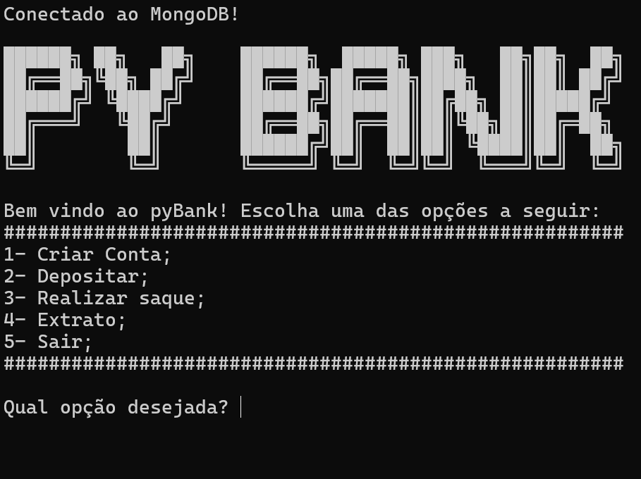

 
# Desafio de Projeto DIO: Sistema Bancário Python

Aplicação desenvolvida para simular operações bancárias como criar novas
contas, realizar depósitos, realizar saques e verificar o extrato da conta.
Utiliza MongoDB Atlas como banco de dados para armazenamento das informações.



## Características
- Autenticação e autorização de usuário.
- Criação de contas únicas por nome de usuário.
- Funções de depósito e saques.
- Verificar extrato.

## Tecnologias usadas
- Python
- MongoDB Atlas

## Instalação

```
git clone https://github.com/marckesin/Sistema-Bancario-Python
```
- Acesse a pasta do Projeto

```
cd Sistema-Bancario-python
```

- Instale as dependências

```
pip install -r requirements.txt
```
- Para poder rodar localmente é necessário a instalação do [MongoDB Compass](https://www.mongodb.com/try/download/shell)

- Esse trecho do código informa que a conexão é local

```
client = MongoClient("localhost", 27017)
```

- Rode a aplicação

```
python pyBank.py
```
